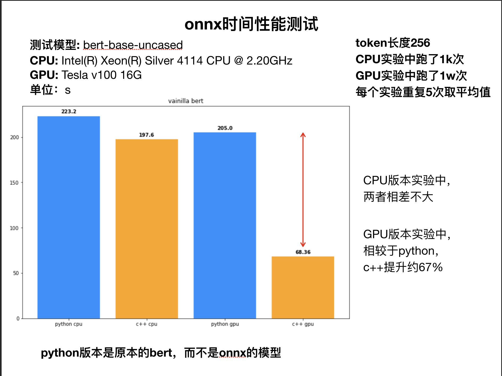

# onnx-test
基于bert-base-uncased的onnx推理性能测试

测试了python与c++基于CPU与GPU的运行速度

## dependency

python

-   transformer==3.4.0
-   onnx==1.10.1
-   torch==1.8.0

c++

-   onnxruntime==1.1.2

## result

## other

-   在setrank模型上尝试过基于python与c++都导出为onnx模型的性能比较，在GPU上两者性能差距不大

-   python_test文件中包含了测试代码和导出代码，但写的比较乱
